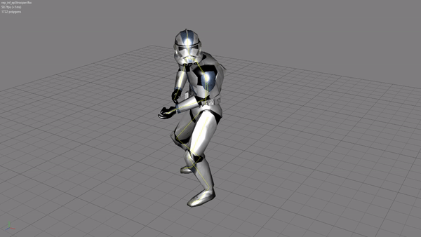
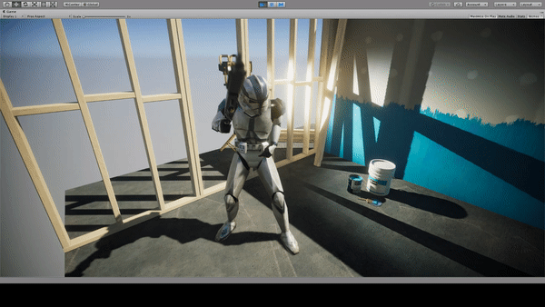

# MSH to FBX Converter

This tool converts Meshes, Skeletons and Animations from Pandemics mesh format (MSH2), used in the old Star Wars Battlefront (2004, 2005) series, into Autodesks FBX format which is known by all major Game Engines and 3D Modelling Software.<br />
<br />
Join us on [Discord](https://discord.com/invite/nNUapcU)<br />
<br /><br />



<br /><br />

## How to use
1. Download latest build from [Releases](https://github.com/Ben1138/MSH2FBX/releases)
2. Extract
3. Run ```MSH2FBX.exe --help``` in a Terminal to see all available options.
<br /><br />
Be carefull with the Ignoring Options regarding Points and Bones (Skeleton)! They might brake parentships and result in an useless FBX!<br />
Meshes should be safe to ignore though.
<br /><br />

### Examples
This will convert rep_inf_ep3trooper.msh (lying in the same directory as MSH2FBX.exe) to rep_inf_ep3trooper.fbx, ignoring Shadow Volumes:<br />
```MSH2FBX.exe -m rep_inf_ep3trooper.msh -i Mesh_ShadowVolume```
<br />
This will convert the ep3trooper mesh including all trooper animations into a single fbx (Change the BF2_ModTools accordingly of course):<br />
```MSH2FBX.exe -m rep_inf_ep3trooper.msh -b basepose.msh -oa "C:\BF2_ModTools\assets\Animations\SoldierAnimationBank\human_0" -d rep_inf_ep3trooper.fbx -i Mesh_Lowrez Mesh_ShadowVolume```<br />
Note: The ```-i Mesh_Lowrez Mesh_ShadowVolume``` options will ignore all LOD and shadow volume meshes.
<br /><br />

## Pull and Compile
The folowing process is described for Visual Studio 2017 in x64 release mode. For other build modes, adapt the options respectively.
<br />
1. Download [FBX SDK VS2015](https://www.autodesk.com/developer-network/platform-technologies/fbx-sdk-2019-0) (if not already)
2. In "Configuration Properties / C/C++ / General" Add path to "Additional Include Directories" pointing at the FBX SDK include directory (default: C:\Program Files\Autodesk\FBX\FBX SDK\2019.0\include)
3. In "Configuration Properties / Linker / General" Add path to "Additional Library Directories" pointing at the appropriate FBX SDK library directory (default: C:\Program Files\Autodesk\FBX\FBX SDK\2019.0\lib\vs2015\x64\release)
4. Make sure "Configuration Properties / C/C++ / Language / Conformance Mode" is set to NO (FBX headers wont compile otherwise)
5. Make sure "Configuration Properties / C/C++ / Language / C++ Language Standard" is set to ISO C++ 17
6. Make sure "Configuration Properties / Linker / Input / Additional Dependencies" includes libfbxsdk.lib
7. Make sure a copy of libfbxsdk.dll (default: C:\Program Files\Autodesk\FBX\FBX SDK\2019.0\lib\vs2015\x64\release) exists in the output directory of MSH2FBX (default: MSH2FBX\x64\Release)
8. Compile MSH2FBX
