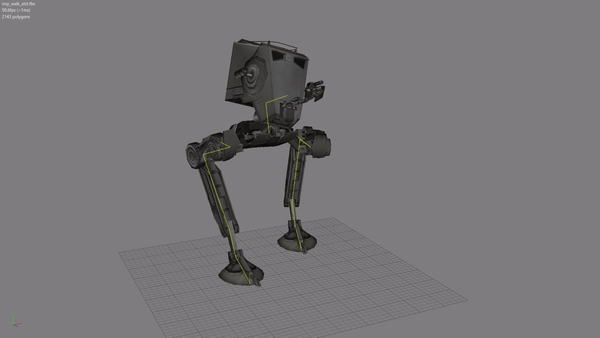

# MSH to FBX Converter

This tool converts Meshes, Skeletons and Animations from Pandemics mesh format (MSH2), used in the old Star Wars Battlefront (2004, 2005) series, into Autodesks FBX format which is known by all major Game Engines and 3D Modelling Software.<br />
<br />
[Download the latest version here](https://github.com/Ben1138/MSH2FBX/releases).<br />
Join us on [Discord](https://discord.com/invite/nNUapcU)<br />
<br /><br />



<br /><br />

## How to use
1. Download latest build from [Releases](https://github.com/Ben1138/MSH2FBX/releases)
2. Extract
3. Run ```MSH2FBX.exe --help``` in a Terminal to see all available options.
<br /><br />
Be carefull with the Ignoring Options regarding Points and Bones (Skeleton)! They might brake parentships and result in an useless FBX!<br />
Meshes should be safe to ignore though.
<br /><br />

### Examples
This will convert rep_inf_ep3trooper.msh (lying in the same directory as MSH2FBX.exe) to rep_inf_ep3trooper.fbx, ignoring Shadow Volumes:<br />
```MSH2FBX.exe -m rep_inf_ep3trooper.msh -i Mesh_ShadowVolume```
<br />
This will convert the ep3trooper mesh including all trooper animations into a single fbx (Change the BF2_ModTools accordingly of course):<br />
```MSH2FBX.exe -m rep_inf_ep3trooper.msh -b basepose.msh -oa "C:\BF2_ModTools\assets\Animations\SoldierAnimationBank\human_0" -d rep_inf_ep3trooper.fbx -i Mesh_Lowrez Mesh_ShadowVolume```<br />
Note: The ```-i Mesh_Lowrez Mesh_ShadowVolume``` options will ignore all LOD and shadow volume meshes.
